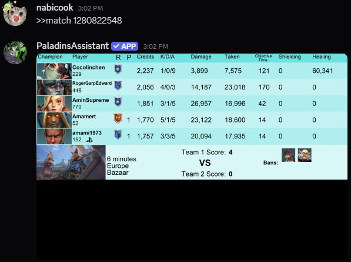
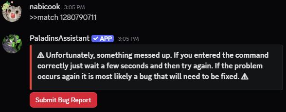
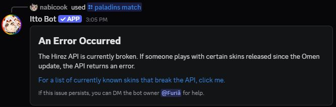
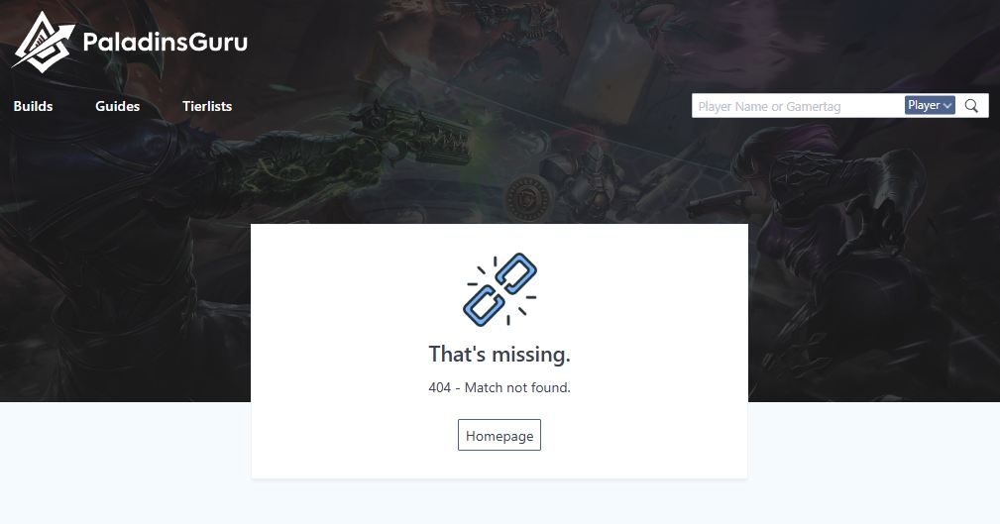
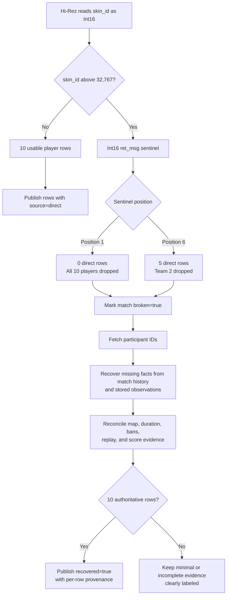
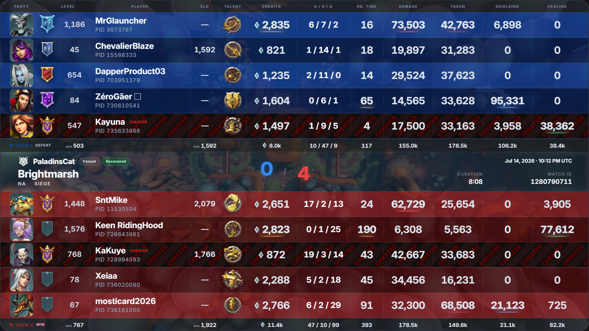

<!--
  PaladinsCat Blog — Int16 Match Recovery Breakthrough
  Public-facing content. No source code or private backend details.
-->

# Beyond the Int16 Overflow: Recovering the Match Hi-Rez Drops

> One broken skin can truncate a match response, erase an entire team from the result, and make the match appear not to exist. PaladinsCat treats that failure as recoverable evidence.

---

**Published:** July 2026 &nbsp;|&nbsp; **Topic:** API resilience · Match recovery · Data provenance

---

## From a known bug to a working recovery system

Our [first Int16 overflow post](skin-id-overflow.md) documented the numeric boundary behind broken Paladins skin data. Skin IDs now exceed the signed 16-bit maximum of **32,767**, but part of the Hi-Rez match-data path still attempts to read the value as an `Int16`.

The boundary itself was not a new discovery. The issue had been known for more than five years. The breakthrough that started PaladinsCat development in **May 2026** was learning how the failure changes the raw match response—and building a system that can recover the match instead of returning an error, five-player fragment, or 404.

This post follows that failure from the raw Hi-Rez payload to the final PaladinsCat scoreboard.

---

## What the raw API response looks like

The practical failure occurs in `getmatchdetailsbatch`. The endpoint returns an ordered sequence of player rows. When its serializer reaches a player using an affected skin, the response can contain a valid prefix followed by an error sentinel:

```json
[
  {
    "Match": 1280822548,
    "TaskForce": 1,
    "playerId": "<valid player ID>",
    "SkinId": "<valid skin ID>",
    "ret_msg": null
  },
  {
    "...": "four more valid Team 1 player rows"
  },
  {
    "Match": 1280822548,
    "playerId": 0,
    "SkinId": "<value above 32767>",
    "ret_msg": "Value was either too large or too small for an Int16. Failing Field = skin_id"
  }
]
```

> [!NOTE]
> This is an abridged representation of the response shape. Repeated player statistics and unrelated fields are omitted; the `ret_msg` text is preserved exactly.

This is not a normal HTTP failure with a clean error status. Valid player objects and an application-level `ret_msg` can arrive in the same response. A consumer must understand both the order and the incompleteness of the payload.

### Case 1: the broken skin is in player position six

The response stops being useful at the broken row. If the affected skin appears in player position six—the first slot on Team 2—the API has already emitted the five Team 1 players. The broken sixth row becomes the sentinel, and the remaining Team 2 rows never arrive.

That exact shape is visible for match [`1280822548`](https://paladinscat.com/matches/1280822548):



*PaladinsAssistant displays the five-player prefix. Team 2 is absent after the broken skin occupies the sixth player position.*

Returning five valid rows is especially dangerous because the payload looks partially successful. A client that only checks whether the array is non-empty can render half a scoreboard without realizing that the other team was dropped.

### Case 2: the broken skin is in player position one

The more extreme failure happens when the affected skin belongs to the first player in the ordered payload. The serializer fails before it emits a single valid player row:

```json
[
  {
    "Match": 1280790711,
    "playerId": 0,
    "SkinId": "<value above 32767>",
    "ret_msg": "Value was either too large or too small for an Int16. Failing Field = skin_id"
  }
]
```

There is no healthy prefix to preserve. The first player becomes the error sentinel, the other nine players are never emitted, and all ten player rows disappear from the direct result. Consumers that expect a normal scoreboard receive an API error or treat the match as missing.

---

## How the failure appears to players

The examples below show the extreme first-position failure for match `1280790711`: the broken skin is encountered before any valid player row, so the direct payload loses all ten players. Different consumers surface that same upstream failure in different ways. These screenshots are not presented as criticism of the services involved; they document the user-visible outcomes of the failed Hi-Rez response.

### Generic command failure



*PaladinsAssistant cannot render match `1280790711` and returns a generic retry or bug message.*

### Explicit broken-skin error



*Itto Bot recognizes the affected-skin condition but still cannot provide the match result.*

### Match not found



*Paladins.guru surfaces the failed upstream result as “404 — Match not found.”*

The visible outcomes differ, but the lost information is the same: the player cannot inspect the complete match.

---

## Failure and Recovery Flow

PaladinsCat treats the Hi-Rez `ret_msg` and any surviving player rows as a damaged evidence set—not as proof that the whole match is unusable. Both the zero-player and five-player failures enter the same recovery flow:



### Provenance Legend

| Label | Meaning | Treatment |
|:---|:---|:---|
| `direct` | Player row survived the standard match-details response | Preserved as high-quality direct evidence |
| `recovered` | Player facts were reconstructed from match-specific history or observations | Published as authoritative recovery evidence |
| `minimal` | Only a limited fallback record could be established | Kept visibly lower-confidence |

---

## Direct evidence and recovered evidence working together

Match [`1280822548`](https://paladinscat.com/matches/1280822548) demonstrates the mixed-source path:

- The external partial result shows only five players.
- PaladinsCat publishes all ten authoritative player rows.
- Five surviving rows retain `source=direct`.
- Five missing rows are restored with `source=recovered`.
- The match remains labeled `broken=true` and `recovered=true`, so the repair is visible rather than hidden.

Match [`1280790711`](https://paladinscat.com/matches/1280790711) demonstrates full reconstruction after the first-position failure. Because the broken skin appears before any valid direct row, all ten players must be recovered. Its live PaladinsCat result contains ten authoritative rows with `source=recovered` and retains two confirmed-cheater account tags that would otherwise be hidden behind an API error or missing-match page.



*PaladinsCat publishes the complete scoreboard for match `1280790711`, labels it Recovered, and retains account-level evidence on the affected player rows.*

> [!IMPORTANT]
> Account tags shown here reflect PaladinsCat's confirmed status at the time of capture. They provide data-driven community evidence and do not replace official moderation or independent review.

---

## Why this is the breakthrough

The breakthrough is not the discovery that **32,767** is the Int16 limit. It is recognizing that the Hi-Rez response before the sentinel is still valuable, that the absent rows can be reconstructed from independent match evidence, and that direct and recovered facts must remain distinguishable.

The consolidated flow above turns a long-standing upstream failure into a transparent data-quality state. For players, the difference is simple: instead of an error, half a team, or a 404, they receive a complete scoreboard with visible provenance and evidence that remains available for community review.

---

*Screenshots and match-status observations were captured on July 16, 2026. Third-party interfaces and account statuses may change after publication.*
